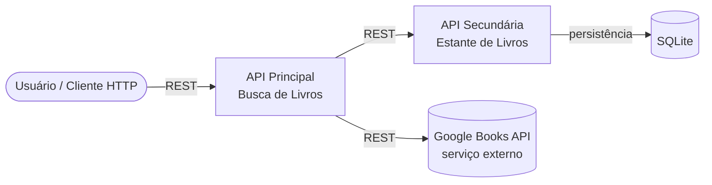
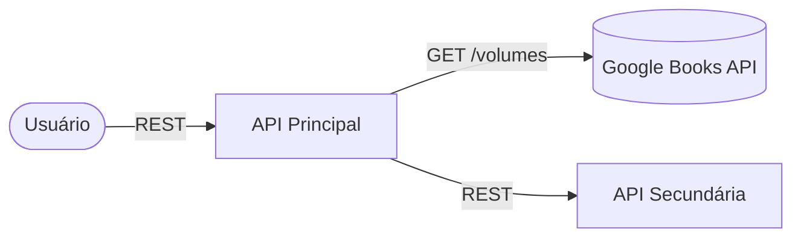

# API Principal — Busca de Livros

Componente responsável por buscar livros na **Google Books API** (serviço
externo) e repassar operações de estante para a **API Secundária**.

Este projeto faz parte do MVP **Estante de Livros**, composto por dois
repositórios independentes que se comunicam via REST:
- **Este repositório**: API Principal (busca + orquestração)
- [estante-api-secundaria](../../estante-api-secundaria) *(ajuste este link
  para a URL real do outro repositório no GitHub)*: API Secundária
  (persistência da estante em SQLite)

## Arquitetura geral do MVP



## Arquitetura deste componente



## API Externa utilizada

- **Nome**: Google Books API
- **Licença/uso**: gratuita. Recomendado usar uma chave de API própria
  (gratuita, criada no [Google Cloud Console](https://console.cloud.google.com/)
  ativando a "Books API" e gerando uma "API key"), pois o uso sem chave
  compartilha uma cota anônima muito pequena entre todos os usuários do mundo
  e costuma esbarrar em erro 429 (cota excedida)
- **Cadastro**: crie um projeto no Google Cloud Console e ative a Books API
  (sem necessidade de cartão de crédito)
- **Documentação**: https://developers.google.com/books/docs/v1/using
- **Rota consumida**: `GET https://www.googleapis.com/books/v1/volumes?q={termo}&key={sua_chave}`
- Os dados retornados (título, autores, capa) são tratados e reformatados
  antes de serem devolvidos ao cliente — nenhum redirecionamento é feito.

### Configurando sua chave

1. Copie `.env.example` para `.env`
2. Preencha: `GOOGLE_BOOKS_API_KEY=sua_chave_aqui`
3. O `docker-compose` lê esse arquivo automaticamente

## Rotas

| Método | Rota                        | Descrição                                   |
|--------|-----------------------------|----------------------------------------------|
| GET    | `/livros/buscar?q=...`      | Busca livros na Google Books API              |
| GET    | `/livros/estante`           | Lista a estante (via API Secundária)          |
| POST   | `/livros/estante`           | Adiciona um livro à estante                   |
| PUT    | `/livros/estante/{id}`      | Atualiza status/nota de um livro da estante   |
| DELETE | `/livros/estante/{id}`      | Remove um livro da estante                    |

## Instalação e execução

### Com Docker + docker-compose (recomendado, sobe as duas APIs)

Clone os dois repositórios lado a lado, na mesma pasta:

```
minha-pasta/
├── estante-api-principal/   (este repositório)
└── estante-api-secundaria/
```

Copie `.env.example` para `.env` dentro deste repositório e preencha sua
chave da Google Books API (veja a seção "API Externa utilizada" abaixo).
Depois, dentro de `estante-api-principal/`:

```bash
docker compose up --build
```

- API Principal: http://localhost:8000/docs
- API Secundária: http://localhost:8001/docs

### Só esta API, isoladamente

```bash
docker build -t api-principal .
docker run -p 8000:8000 -e API_SECUNDARIA_URL=http://host.docker.internal:8001 api-principal
```

> A API Secundária precisa estar rodando e acessível na URL informada em
> `API_SECUNDARIA_URL`.

### Localmente (sem Docker)

```bash
python -m venv venv
source venv/bin/activate   # Windows: venv\Scripts\activate
pip install -r requirements.txt
export API_SECUNDARIA_URL=http://localhost:8001
uvicorn main:app --reload --port 8000
```

Depois acesse a documentação interativa em: http://localhost:8000/docs
